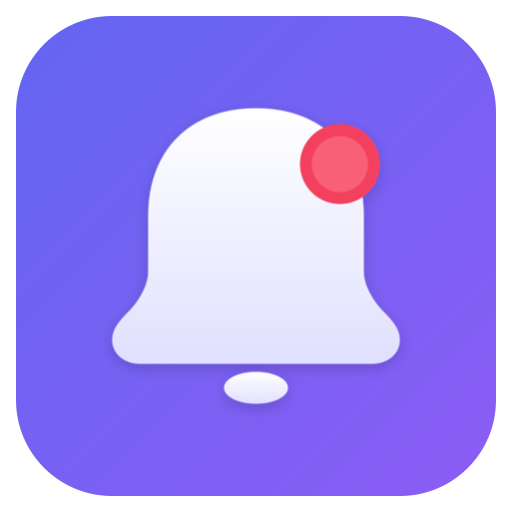

<p align="center">
  
</p>

# NativePHP Mobile Local Notifications

[](https://packagist.org/packages/ikromjon/nativephp-mobile-local-notifications)
[](https://github.com/Ikromjon1998/nativephp-mobile-local-notifications/actions/workflows/tests.yml)
[](https://packagist.org/packages/ikromjon/nativephp-mobile-local-notifications)
[](https://packagist.org/packages/ikromjon/nativephp-mobile-local-notifications)

Schedule, manage, and cancel local notifications in your NativePHP Mobile app — no server or Firebase required.

## How is this different?

| Plugin | What it does | Requires |
|--------|-------------|----------|
| **nativephp/mobile-dialog** | Toast/snackbar messages (in-app only, disappear when app closes) | Nothing |
| **nativephp/mobile-firebase** | Push notifications from a server via FCM/APNs | Firebase project, server, internet |
| **This plugin** | Local notifications scheduled on-device | Nothing — works offline |

## What's New in v1.4.0

- **`<x-local-notifications::init />` Blade component** — Drop it into your layout once and cold-start notification tap events are flushed automatically on every page load. No more manual `checkPermission()` calls in `mount()`.
- **Publishable config** — Customize channel ID/name, max actions, repeat constraints, sound defaults, and timing via `config/local-notifications.php`
- **Runtime native config** — PHP config values flow to both Android and iOS at runtime via the `_config` bridge parameter
- **Config-driven validation** — Action count and repeat interval limits read from config
- **Cross-platform config support** — `default_sound` and `max_actions` are now respected on both Android and iOS

See the full [CHANGELOG](CHANGELOG.md) for details.

## Features

- Schedule notifications with a delay or at a specific time
- Repeat intervals: minute, hourly, daily, weekly, monthly, yearly
- Custom repeat intervals (any duration >= 60 seconds)
- Day-of-week scheduling (e.g. every Mon/Wed/Fri at 9 AM)
- Repeat count limits (fire N times then stop)
- Rich content: images, subtitles, and expanded text
- Action buttons with text input support (configurable limit, default 3)
- Custom sounds, badges, and data payloads
- Cancel individual or all notifications
- List pending notifications
- Permission management (Android 13+, iOS)
- Survives device reboot (Android)
- Events for notification lifecycle (scheduled, received, tapped, action pressed)
- Cold-start tap event auto-flush via Blade component
- Works completely offline — no server or Firebase needed

## Installation

```bash
composer require ikromjon/nativephp-mobile-local-notifications

php artisan native:plugin:register ikromjon/nativephp-mobile-local-notifications
```

> **Note:** If you don't have a `NativeServiceProvider` yet, publish it first:
> ```bash
> php artisan vendor:publish --tag=nativephp-plugins-provider
> ```

Build your app (plugin requires a native build — it does not work with Jump):

```bash
php artisan native:run android
# or
php artisan native:run ios
```

## Configuration

Optionally publish the config file to customize defaults:

```bash
php artisan vendor:publish --tag=local-notifications-config
```

This creates `config/local-notifications.php` where you can set:

| Key | Default | Platform | Description |
|-----|---------|----------|-------------|
| `channel_id` | `nativephp_local_notifications` | Android | Notification channel ID. Change if you use multiple notification plugins |
| `channel_name` | `Local Notifications` | Android | Channel name shown in device notification settings |
| `channel_description` | `Notifications scheduled by the app` | Android | Channel description in device settings |
| `max_actions` | `3` | Both | Max action buttons per notification |
| `min_repeat_interval_seconds` | `60` | Both | Minimum custom repeat interval in seconds |
| `default_sound` | `true` | Both | Play sound when no explicit `sound` parameter is provided |
| `tap_detection_delay_ms` | `500` | Android | Warm-start tap detection delay. Most apps should not change this |
| `navigation_replay_duration_ms` | `15000` | Android | Cold-start event replay window. Most apps should not change this |

You can also use environment variables for channel settings:

```env
LOCAL_NOTIFICATIONS_CHANNEL_ID=my_app_notifications
LOCAL_NOTIFICATIONS_CHANNEL_NAME="My App Alerts"
```

## Cold-Start Tap Events

When a user taps a notification while the app is closed (cold start), the `NotificationTapped` event is queued on the native side but only delivered when a bridge function is called. The init component automates this — but each step matters:

### 1. Add the init component after `@livewireScripts`

```blade
{{-- resources/views/layouts/app.blade.php --}}
    @livewireScripts
    <x-local-notifications::init />
</body>
```

**Why after `@livewireScripts`?** The component waits for `livewire:navigated`, which fires after Livewire components are hydrated. If placed in `<head>` or before Livewire, events are dispatched before components are listening — they get silently lost.

### 2. Put the listener on your landing page component

```php
// The component at route "/" — the page that opens on cold start
#[OnNative(NotificationTapped::class)]
public function onTapped(string $id = '', string $title = '', string $body = '', array $data = []): void
{
    // Handle the tap
}
```

**Why the landing page?** On cold start, the app always opens to `/`. Only components mounted on that page can receive the event. If your listener is on `/settings`, it won't be mounted when the event fires.

### 3. Use named parameters (Livewire 4)

```php
// Wrong — Livewire 4 maps payload keys to named params, $data stays empty
public function onTapped(array $data = []): void

// Correct — matches the payload keys: id, title, body, data
public function onTapped(string $id = '', string $title = '', string $body = '', array $data = []): void
```

**Why named parameters?** Livewire 4 dispatches event payloads as named arguments (`{id, title, body, data}`), not a single array. A parameter named `$data` only receives the `data` key from the payload, not the entire payload.

> **Without the init component**, you would need to manually call `LocalNotifications::checkPermission()` (or any other bridge function) after Livewire hydration to trigger the flush.

## Usage (PHP)

### Request Permission

Required on Android 13+ and iOS before notifications can be shown.

```php
use Ikromjon\LocalNotifications\Facades\LocalNotifications;
use Ikromjon\LocalNotifications\Enums\RepeatInterval;

$result = LocalNotifications::requestPermission();
// Returns: ['granted' => true] or ['granted' => false, 'status' => 'pending']
```

### Schedule a Notification

```php
// Fire after a delay (seconds)
LocalNotifications::schedule([
    'id' => 'reminder-1',
    'title' => 'Reminder',
    'body' => 'Time to take a break!',
    'delay' => 300, // 5 minutes from now
]);

// Fire at a specific time
LocalNotifications::schedule([
    'id' => 'meeting-alert',
    'title' => 'Meeting in 15 minutes',
    'body' => 'Team standup in the main room',
    'at' => now()->addMinutes(15)->timestamp,
]);

// Repeating daily notification (using enum — recommended)
LocalNotifications::schedule([
    'id' => 'daily-checkin',
    'title' => 'Daily Check-in',
    'body' => 'How are you feeling today?',
    'at' => now()->setTime(9, 0)->timestamp, // every day at 9:00 AM
    'repeat' => RepeatInterval::Daily,
]);

// Repeating hourly notification
LocalNotifications::schedule([
    'id' => 'hydration',
    'title' => 'Drink Water',
    'body' => 'Stay hydrated!',
    'delay' => 3600, // first one in 1 hour, then every hour
    'repeat' => RepeatInterval::Hourly,
]);

// String values still work for backwards compatibility
LocalNotifications::schedule([
    'id' => 'weekly-review',
    'title' => 'Weekly Review',
    'body' => 'Time to review your progress',
    'at' => now()->next('Monday')->setTime(10, 0)->timestamp,
    'repeat' => 'weekly', // string also accepted
]);

// With custom data and options
LocalNotifications::schedule([
    'id' => 'task-due',
    'title' => 'Task Due',
    'body' => 'Complete the report',
    'delay' => 3600,
    'sound' => true,
    'badge' => 1,
    'data' => ['task_id' => 42, 'priority' => 'high'],
]);

// With rich content (image, subtitle, expanded text)
LocalNotifications::schedule([
    'id' => 'promo',
    'title' => 'New Arrival',
    'body' => 'Check out our latest product',
    'subtitle' => 'Limited time offer',
    'image' => 'https://example.com/product.jpg',
    'bigText' => 'We just launched an amazing new product that you will love. Tap to learn more and get 20% off your first order!',
    'delay' => 60,
]);

// With action buttons
LocalNotifications::schedule([
    'id' => 'message-1',
    'title' => 'New Message',
    'body' => 'Hey, are you free tonight?',
    'delay' => 5,
    'actions' => [
        ['id' => 'reply', 'title' => 'Reply', 'input' => true],
        ['id' => 'like', 'title' => 'Like'],
        ['id' => 'delete', 'title' => 'Delete', 'destructive' => true],
    ],
]);
```

### Schedule Parameters

| Parameter | Type | Required | Description |
|-----------|------|----------|-------------|
| `id` | string | Yes | Unique identifier for the notification |
| `title` | string | Yes | Notification title |
| `body` | string | Yes | Notification body text |
| `delay` | int | No | Delay in seconds from now |
| `at` | int | No | Unix timestamp to fire at |
| `repeat` | RepeatInterval\|string | No | Repeat interval (see table below) |
| `repeatIntervalSeconds` | int | No | Custom repeat interval in seconds (min 60). Mutually exclusive with `repeat` |
| `repeatDays` | array\<int\> | No | Days of week to repeat (1=Mon..7=Sun). Requires `at`. Mutually exclusive with `repeat` |
| `repeatCount` | int | No | Limit how many times the notification repeats (min 1). Requires a repeat mechanism |
| `sound` | bool | No | Play sound (default from `config('local-notifications.default_sound')`, initially `true`) |
| `badge` | int | No | Badge number on app icon (iOS) |
| `data` | array | No | Custom data payload (available in tapped event) |
| `subtitle` | string | No | Subtitle text (iOS: subtitle, Android: subtext) |
| `image` | string | No | Image URL (http/https only) to display in the notification |
| `bigText` | string | No | Expanded body text shown when notification is expanded |
| `actions` | array | No | Action buttons (limit set by `config('local-notifications.max_actions')`, default 3), each with `id`, `title`, optional `destructive` and `input` |

Either `delay` or `at` should be provided. If neither is set, the notification fires after 1 second.

### Cancel Notifications

```php
// Cancel a specific notification
LocalNotifications::cancel('reminder-1');

// Cancel all notifications
LocalNotifications::cancelAll();
```

### List Pending Notifications

```php
$result = LocalNotifications::getPending();
// Returns: ['success' => true, 'notifications' => '[...]', 'count' => 3]
```

### Check Permission Status

```php
$result = LocalNotifications::checkPermission();
// Returns: ['status' => 'granted'] or ['status' => 'denied']
```

## Listening to Events (Livewire)

Use the `#[OnNative]` attribute in your Livewire components:

```php
use Native\Mobile\Attributes\OnNative;
use Ikromjon\LocalNotifications\Events\NotificationScheduled;
use Ikromjon\LocalNotifications\Events\NotificationReceived;
use Ikromjon\LocalNotifications\Events\NotificationTapped;
use Ikromjon\LocalNotifications\Events\PermissionGranted;
use Ikromjon\LocalNotifications\Events\PermissionDenied;
use Ikromjon\LocalNotifications\Events\NotificationActionPressed;

#[OnNative(NotificationScheduled::class)]
public function onScheduled($data)
{
    // Notification was scheduled: $data['id'], $data['title'], $data['body']
}

#[OnNative(NotificationReceived::class)]
public function onReceived($data)
{
    // Notification was delivered to the device
}

#[OnNative(NotificationTapped::class)]
public function onTapped($data)
{
    // User tapped a notification: $data['id'], $data['data']
}

#[OnNative(PermissionGranted::class)]
public function onPermissionGranted()
{
    // Permission was granted
}

#[OnNative(PermissionDenied::class)]
public function onPermissionDenied()
{
    // Permission was denied
}

#[OnNative(NotificationActionPressed::class)]
public function onActionPressed($data)
{
    // Action button pressed: $data['notificationId'], $data['actionId']
    // Text input (if input action): $data['inputText']
}
```

## Listening to Events (Laravel)

For apps using native UI (EDGE components) or any context without Livewire, register standard Laravel event listeners. Events are dispatched to the PHP backend regardless of the frontend stack.

```php
// app/Listeners/HandleNotificationTap.php
namespace App\Listeners;

use Ikromjon\LocalNotifications\Events\NotificationTapped;

class HandleNotificationTap
{
    public function handle(NotificationTapped $event): void
    {
        // $event->id, $event->title, $event->body, $event->data
    }
}
```

Register in your `AppServiceProvider` or `EventServiceProvider`:

```php
use App\Listeners\HandleNotificationTap;
use App\Listeners\HandleNotificationAction;
use Ikromjon\LocalNotifications\Events\NotificationTapped;
use Ikromjon\LocalNotifications\Events\NotificationActionPressed;

protected $listen = [
    NotificationTapped::class => [HandleNotificationTap::class],
    NotificationActionPressed::class => [HandleNotificationAction::class],
];
```

This approach works with **all frontend stacks**: Livewire, Inertia (Vue/React), and native UI (EDGE) — no WebView required.

## Usage (JavaScript)

For apps using Inertia with Vue or React, import functions directly from the plugin's JavaScript library. The CSRF token is read automatically from your page's `<meta name="csrf-token">` tag.

```js
import {
    schedule,
    cancel,
    cancelAll,
    getPending,
    requestPermission,
    checkPermission,
    Events,
} from '../../vendor/ikromjon/nativephp-mobile-local-notifications/resources/js/index.js';

// Request permission
const { granted } = await requestPermission();

// Schedule a notification
await schedule({
    id: 'reminder-1',
    title: 'Reminder',
    body: 'Time to take a break!',
    delay: 300,
});

// Schedule a repeating notification with actions
await schedule({
    id: 'daily-checkin',
    title: 'Daily Check-in',
    body: 'How are you feeling today?',
    at: Math.floor(Date.now() / 1000) + 60, // 1 minute from now
    repeat: 'daily',
    actions: [
        { id: 'done', title: 'Done' },
        { id: 'snooze', title: 'Snooze' },
    ],
});

// Cancel a notification
await cancel('reminder-1');

// Cancel all notifications
await cancelAll();

// List pending notifications
const { notifications, count } = await getPending();

// Check permission status
const { status } = await checkPermission();
```

### Listening to Events (JavaScript)

Use the NativePHP `On()` function with the plugin's `Events` constants:

```js
import { On } from '#nativephp';
import { Events } from '../../vendor/ikromjon/nativephp-mobile-local-notifications/resources/js/index.js';

// User tapped a notification
On(Events.NotificationTapped, (payload) => {
    console.log('Tapped:', payload.id, payload.data);
});

// Notification was delivered
On(Events.NotificationReceived, (payload) => {
    console.log('Received:', payload.id);
});

// Action button pressed
On(Events.NotificationActionPressed, (payload) => {
    console.log('Action:', payload.actionId, payload.inputText);
});

// Permission result
On(Events.PermissionGranted, () => console.log('Permission granted'));
On(Events.PermissionDenied, () => console.log('Permission denied'));
```

### Available JavaScript Functions

| Function | Parameters | Returns |
|----------|-----------|---------|
| `schedule(options)` | Object with `id`, `title`, `body`, and optional scheduling params | `{ success, id?, error? }` |
| `cancel(id)` | Notification ID string | `{ success, id?, error? }` |
| `cancelAll()` | None | `{ success, error? }` |
| `getPending()` | None | `{ success, notifications?, count?, error? }` |
| `requestPermission()` | None | `{ granted, status?, error? }` |
| `checkPermission()` | None | `{ status, error? }` |

### Available Event Constants

| Constant | PHP Event Class |
|----------|----------------|
| `Events.NotificationScheduled` | `NotificationScheduled` |
| `Events.NotificationReceived` | `NotificationReceived` |
| `Events.NotificationTapped` | `NotificationTapped` |
| `Events.NotificationActionPressed` | `NotificationActionPressed` |
| `Events.PermissionGranted` | `PermissionGranted` |
| `Events.PermissionDenied` | `PermissionDenied` |

## Repeat Intervals

Use the `RepeatInterval` enum (recommended) or pass the string value directly:

| Enum | String | Description |
|------|--------|-------------|
| `RepeatInterval::Minute` | `'minute'` | Every minute |
| `RepeatInterval::Hourly` | `'hourly'` | Every hour |
| `RepeatInterval::Daily` | `'daily'` | Every day |
| `RepeatInterval::Weekly` | `'weekly'` | Every week |
| `RepeatInterval::Monthly` | `'monthly'` | Every month (handles variable month lengths) |
| `RepeatInterval::Yearly` | `'yearly'` | Every year (handles leap years) |

### Custom Repeat Interval

Use `repeatIntervalSeconds` for any interval >= 60 seconds:

```php
// Every 2 hours
LocalNotifications::schedule([
    'id' => 'custom-interval',
    'title' => 'Check In',
    'body' => 'Time for a check-in',
    'repeatIntervalSeconds' => 7200,
]);
```

### Day-of-Week Scheduling

Use `repeatDays` to fire on specific days of the week. Days use ISO format: 1=Monday through 7=Sunday. Requires `at` to set the time of day.

```php
// Weekdays at 8:30 AM
LocalNotifications::schedule([
    'id' => 'weekday-alarm',
    'title' => 'Good Morning',
    'body' => 'Time to start the day!',
    'at' => now()->setTime(8, 30)->timestamp,
    'repeatDays' => [1, 2, 3, 4, 5], // Mon-Fri
]);
```

### Repeat Count Limit

Use `repeatCount` to limit how many times a notification repeats:

```php
// Remind 3 times, then stop
LocalNotifications::schedule([
    'id' => 'limited-reminder',
    'title' => 'Take your medicine',
    'body' => 'Time for your dose',
    'repeat' => RepeatInterval::Daily,
    'at' => now()->setTime(20, 0)->timestamp,
    'repeatCount' => 3,
]);
```

### Type-Safe DTO

You can use the `NotificationOptions` DTO instead of arrays for type safety:

```php
use Ikromjon\LocalNotifications\Data\NotificationOptions;
use Ikromjon\LocalNotifications\Data\NotificationAction;

$options = new NotificationOptions(
    id: 'dto-example',
    title: 'DTO Notification',
    body: 'Using the type-safe DTO',
    repeat: RepeatInterval::Daily,
    at: now()->setTime(9, 0)->timestamp,
    repeatCount: 7,
    actions: [
        new NotificationAction(id: 'done', title: 'Done'),
        new NotificationAction(id: 'snooze', title: 'Snooze'),
    ],
);

LocalNotifications::schedule($options);
```

### How Repeating Notifications Work

On **iOS**, the system natively supports repeating notifications via calendar triggers — no extra work needed.

On **Android**, the plugin uses exact alarms (`setExactAndAllowWhileIdle`) with **automatic self-rescheduling**. When a repeating notification fires, the native receiver immediately schedules the next occurrence. This means:

- Notifications fire at **exact times**, not batched by the OS
- Works reliably under **Doze mode** and **battery optimization**
- Survives **device reboots** (the BootReceiver restores all scheduled notifications)
- No app-level rescheduling needed — the plugin handles everything natively

**Example: Daily habit reminder**

```php
// Schedule once — fires every day at the specified time automatically
LocalNotifications::schedule([
    'id' => 'habit-meditation',
    'title' => 'Time to Meditate',
    'body' => 'Your 10-minute session is waiting',
    'at' => now()->setTime(7, 0)->timestamp,
    'repeat' => RepeatInterval::Daily,
    'sound' => true,
    'actions' => [
        ['id' => 'done', 'title' => 'Done'],
        ['id' => 'snooze', 'title' => 'Snooze'],
    ],
]);

// To stop it, just cancel by id
LocalNotifications::cancel('habit-meditation');
```

> **Note:** On Android, `repeat: 'minute'` intervals may experience slight drift (~9 minutes) due to system limits on `setExactAndAllowWhileIdle` frequency in Doze mode. For `hourly`, `daily`, and `weekly` intervals this is not an issue.

## Required Permissions

The plugin declares all required permissions automatically via `nativephp.json`. No manual configuration needed.

**Android:**

| Permission | Purpose |
|-----------|---------|
| `POST_NOTIFICATIONS` | Show notifications (Android 13+, requested at runtime) |
| `SCHEDULE_EXACT_ALARM` | Schedule notifications at exact times |
| `USE_EXACT_ALARM` | Fallback for exact alarm scheduling |
| `RECEIVE_BOOT_COMPLETED` | Restore scheduled notifications after device reboot |
| `VIBRATE` | Vibrate on notification delivery |

**iOS:**

- Notification authorization is requested at runtime via `requestPermission()` (alert, sound, badge)
- Minimum iOS version: 18.2

**Environment variables:** None required. The plugin works entirely on-device with no external services.

## Testing

```bash
# Run tests
composer test

# Run static analysis
composer analyse
```

## Requirements

- PHP 8.3+
- NativePHP Mobile v3+
- iOS 18.2+ / Android API 33+

## Example App

**[Daily Habits](https://github.com/Ikromjon1998/daily-habits)** is a full, open-source mobile app built with this plugin. It demonstrates:

- Scheduling daily repeating notifications with `RepeatInterval::Daily`
- Action buttons ("Done" / "Snooze") handled via `NotificationActionPressed`
- Permission management on the Settings screen
- Notification cancellation when habits are deleted

Use it as a reference, fork it as a starter for your own app, or contribute to it.

## Contributing

Contributions are welcome! See [CONTRIBUTING.md](CONTRIBUTING.md) for setup instructions, development workflow, and guidelines.

## Changelog

See [CHANGELOG.md](CHANGELOG.md) for a list of changes in each release.

## Support

For questions or issues, use [GitHub Issues](https://github.com/Ikromjon1998/nativephp-mobile-local-notifications/issues) or contact: ikromjon98.98@icloud.com

## License

MIT
